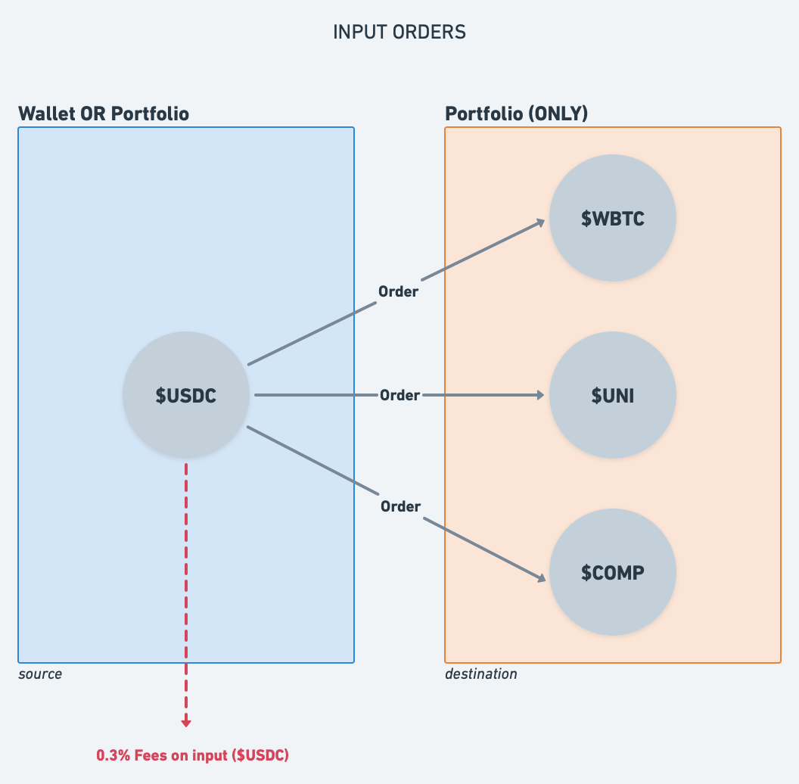
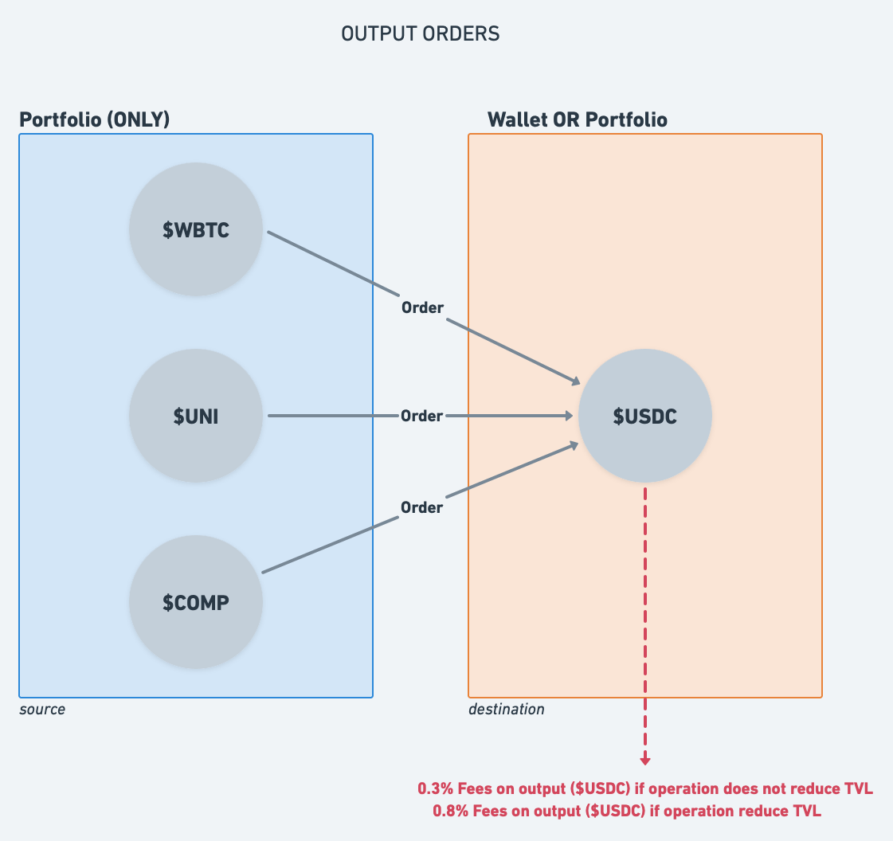
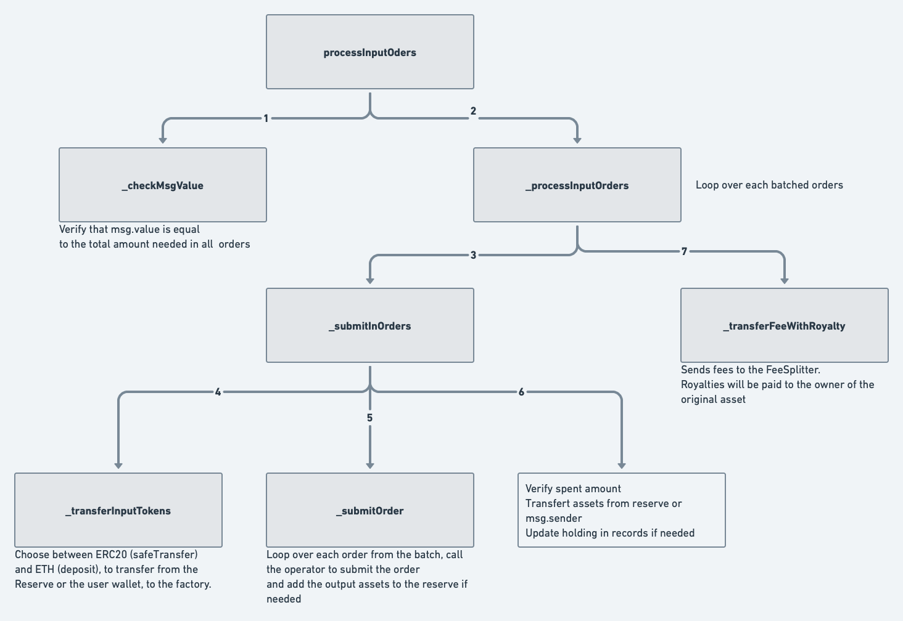
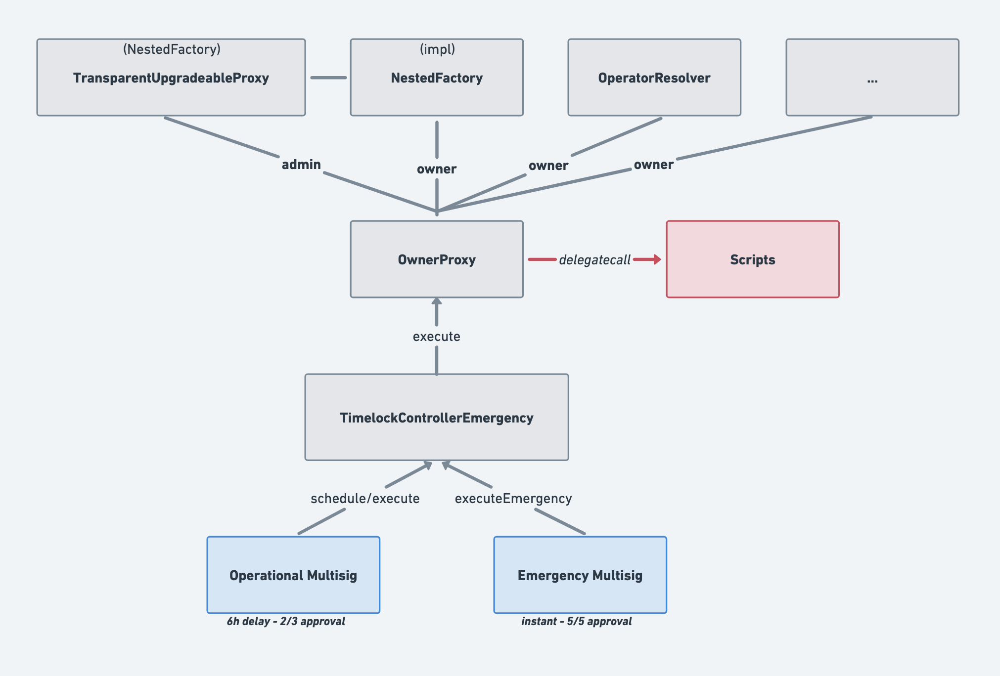

<div align="center"></div>
<br/>

<div align="center"><a href="https://nested.fi" > https://nested.fi </a></div>

# Nested contest details
- $33,250 USDC main award pot
- $1,750 USDC gas optimization award pot
- Join [C4 Discord](https://discord.gg/code4rena) to register
- Submit findings [using the C4 form](https://code4rena.com/contests/2022-06-nested-contest/submit)
- [Read our guidelines for more details](https://docs.code4rena.com/roles/wardens)
- Starts June 15, 2022 20:00 UTC
- Ends June 18, 2022 19:59 UTC

## Scope
**TOTAL = 2 004 LOC & 21 Contracts**
### Core scope
| Contract name                                             |                                                      Github URL                                                                    | LoC |
|-----------------------------------------------------------|------------------------------------------------------------------------------------------------------------------------------------|----:|
| NestedFactory                                             | [NestedFactory.sol](https://github.com/code-423n4/2022-06-nested/blob/main/contracts/NestedFactory.sol)                            | 452 |
| OperatorResolver                                          | [OperatorResolver.sol](https://github.com/code-423n4/2022-06-nested/blob/main/contracts/OperatorResolver.sol)                      | 59  |
| Withdrawer                                                | [Withdrawer.sol](https://github.com/code-423n4/2022-06-nested/blob/main/contracts/Withdrawer.sol)                                  | 18  |
| /abstracts/MixinOperatorResolver                          | [MixinOperatorResolver.sol](https://github.com/code-423n4/2022-06-nested/blob/main/contracts/abstracts/MixinOperatorResolver.sol)  | 68  |
| /abstracts/OwnableProxyDelegation                         | [OwnableProxyDelegation.sol](https://github.com/code-423n4/2022-06-nested/blob/main/contracts/abstracts/OwnableProxyDelegation.sol)| 35  |
| /libraries/ExchangeHelpers                                | [ExchangeHelpers.sol](https://github.com/code-423n4/2022-06-nested/blob/main/contracts/libraries/ExchangeHelpers.sol)              | 21  |

### Operator scope
| Contract name                                             |                                                                    Github URL                                                                                | LoC |
|-----------------------------------------------------------|--------------------------------------------------------------------------------------------------------------------------------------------------------------|----:|
|/operators/Beefy/BeefyVaultOperator                        | [BeefyVaultOperator.sol](https://github.com/code-423n4/2022-06-nested/blob/main/contracts/operators/Beefy/BeefyVaultOperator.sol)                            |  62 |
|/operators/Beefy/BeefyVaultStorage                         | [BeefyVaultStorage.sol](https://github.com/code-423n4/2022-06-nested/blob/main/contracts/operators/Beefy/BeefyVaultStorage.sol)                              |  20 |
|/operators/Beefy/lp/BeefyZapBiswapLPVaultOperator          | [BeefyZapBiswapLPVaultOperator.sol](https://github.com/code-423n4/2022-06-nested/blob/main/contracts/operators/Beefy/lp/BeefyZapBiswapLPVaultOperator.sol)   | 167 |
|/operators/Beefy/lp/BeefyZapUniswapLPVaultOperator         | [BeefyZapUniswapLPVaultOperator.sol](https://github.com/code-423n4/2022-06-nested/blob/main/contracts/operators/Beefy/lp/BeefyZapUniswapLPVaultOperator.sol) | 166 |
|/operators/Paraswap/ParaswapOperator                       | [ParaswapOperator.sol](https://github.com/code-423n4/2022-06-nested/blob/main/contracts/operators/Paraswap/ParaswapOperator.sol)                             |  35 |
|/operators/Yearn/YearnCurveVaultOperator                   | [YearnCurveVaultOperator.sol](https://github.com/code-423n4/2022-06-nested/blob/main/contracts/operators/Yearn/YearnCurveVaultOperator.sol)                  | 222 |
|/operators/Yearn/YearnVaultStorage                         | [YearnVaultStorage.sol](https://github.com/code-423n4/2022-06-nested/blob/main/contracts/operators/Yearn/YearnVaultStorage.sol)                              |  24 |
|/operators/StakeDAO/StakeDaoCurveStrategyOperator          | [StakeDaoCurveStrategyOperator.sol](https://github.com/code-423n4/2022-06-nested/blob/main/contracts/operators/StakeDAO/StakeDaoCurveStrategyOperator.sol)   | 230 |
|/operators/StakeDAO/StakeDaoStrategyStorage                | [StakeDaoStrategyStorage.sol](https://github.com/code-423n4/2022-06-nested/blob/main/contracts/operators/StakeDAO/StakeDaoStrategyStorage.sol)               |  25 |
|/libraries/CurveHelpers                                    | [CurveHelpers.sol](https://github.com/code-423n4/2022-06-nested/blob/main/contracts/libraries/CurveHelpers.sol)                                              | 105 |

### Governance scope
| Contract name                                   |                                                                    Github URL                                                                  | LoC |
|-------------------------------------------------|------------------------------------------------------------------------------------------------------------------------------------------------|----:|
|/governance/OwnerProxy                           | [OwnerProxy.sol](https://github.com/code-423n4/2022-06-nested/blob/main/contracts/governance/OwnerProxy.sol)                                   | 19  |
|/governance/TimelockControllerEmergency          | [TimelockControllerEmergency.sol](https://github.com/code-423n4/2022-06-nested/blob/main/contracts/governance/TimelockControllerEmergency.sol) | 186 |
|/governance/scripts/OperatorScripts              | [OperatorScripts.sol](https://github.com/code-423n4/2022-06-nested/blob/main/contracts/governance/scripts/OperatorScripts.sol)                 | 71  |
 
## Previous Audits

The preview version has been audited 4 times (from oldest to newest):
- [Peckshield Audit Report v1.0](audits/PeckShield-Audit-Report-Nested-v1.0.pdf)
- [Red4Sec Audit Report v1.0](audits/Red4Sec_Nested_Finance_Security_Audit_Report_v3.pdf)
- [CodeArena 2021-11](https://code4rena.com/reports/2021-11-nested)
- [CodeArena 2022-02](https://code4rena.com/reports/2022-02-nested)

⚠️ **All issues already surfaced in the [previous audit](https://code4rena.com/reports/2022-02-nested) will be "invalid"**.

## New version

**TODO**

## Known issues/topics

### Copy my portfolio (fees trick)

A user can copy his own portfolio to reduce the fees, however a require statement won't fix this issue...

This problem cannot be corrected but only mitigated, since the user can use two different wallets.
Currently the front-end doesn't allow to duplicate a portfolio with the same address.

### Deflationary/Rebase Tokens

The protocol is no fully compatible with deflationary/rebase tokens. In fact, you can add a deflationary/rebase token to your portfolio but it can lead to unpredictable behaviors (positive or negative).

We have chosen to manage the tokens with a fixed amount (the input) after considering several solutions.

**So, how can we mitigate that ?**

We're maintaining a list of all rebase tokens (source coingecko, which is well maintained) and prevent users from adding them to their portfolio on the platform.

**TODO** extend to exotic tokens

### Low Decimals

**TODO**

## Coverage

Run `npx hardhat coverage` to run test and generate the coverage summary.
> When you run `npx hardhat coverage`, test wil be ran with the context you specified in the [.env configuration](https://github.com/NestedFi/nested-core-lego#testing).
Only tests that can be run in the environment you have configured will be run to generate the coverage summary. 

>To get the total coverage, it is necessary to run `npx hardhat coverage` with all the existing configurations, to reach all the written tests.

>You can find the 3 existing configrations (BSC, ETH and without fork) in [.env.exemple](https://github.com/NestedFi/nested-core-lego/blob/master/.env.example) file.

### Coverage ran without fork
#### Global coverage - tested without fork
> the missing coverage is tested in the [BSC fork context](#coverage-ran-in-bsc-fork-context) or the [ETH fork context](#coverage-ran-in-eth-fork-context)
<div align="left"></div>

#### Main contracts - tested without fork
<div align="left"></div>


### Coverage ran in ETH fork context
#### Libraries - tested on ETH fork
> The rest of the coverage is in the BSC fork coverage context under [Libraries - tested on BSC fork](#libraries-tested-on-bsc-fork).
<div align="left"></div>

#### CurveHelpers - tested on ETH fork
> The rest of the coverage is in the BSC fork coverage context under [CurveHelpers - tested on BSC fork](#curvehelpers-tested-on-bsc-fork).
<div align="left"></div>

#### Yearn curve vault operator
<div align="left"></div>


### Coverage ran in BSC fork context
#### Libraries - tested on BSC fork
> The rest of the coverage is in the ETH fork coverage context under [Libraries - tested on ETH fork](#libraries-tested-on-eth-fork).
<div align="left"></div>

#### CurveHelpers - tested on BSC fork
> The rest of the coverage is in the ETH fork coverage context under [CurveHelpers - tested on ETH fork](#curvehelpers-tested-on-eth-fork).
<div align="left"></div>


## Links

- **Website** : https://nested.fi
- **Documentation** : https://docs.nested.fi/
- **Medium** : https://medium.com/@nestedfi
- **Github** : https://github.com/NestedFi
- **Twitter** : https://twitter.com/NestedFi
- **Telegram** : https://t.me/NestedFinanceChannel
- **Discord** : https://discord.gg/VW8ZZsACzd

## Contact us 📝

Wardens! If you have any questions, please contact us!

#### Axxe (Smart contract engineer)
- **Telegram** : @axxedev
- **Discord** : axxe#8561
- **Schedule a call** : [Calendly](https://calendly.com/maxime-brugel/lets-talk)

#### Adrien (CTO)

- **Telegram** : @adrienspt
- **Discord** : Adrien | Nested Finance#6564
- **Schedule a call** : [Calendly](https://calendly.com/adrien-supizet/30min)

## Try the application

If you want to try Nested, go to : https://app.nested.fi/.

It can help to better understand the protocol context.

***

# Introduction

Nested is a decentralized protocol providing customizable financial products in the form of NFTs.
The platform allows users to put several digital assets, i.e. ERC20 tokens, inside an NFT (abbreviated as `NestedNFT`).
<br/>

Each NestedNFT is backed by underlying assets:

- Purchased or sold on a decentralized exchange (AMM).
- Collected/earned after adding liquidity or staking.
- Exchanged/Minted on a protocol that is not a decentralized exchange.
- (...)

The main idea is to allow adding modules (**operators**) to interact with new protocols
and enable new assets, without re-deploying.

> The tokens are stored on a self-custodian smart contract.

At the end of the creation process, the user receives the NFT which allows to control all underlying assets of the portfolio.
Furthermore, we allow users to copy other users NestedNFTs. The creator of the initial NestedNFT earns royalties.

### _Further documentation and details can be found here: https://docs.nested.finance/_

# Architecture


## Core contracts

| Name                | Purpose                                                                                                                    |
| ------------------- | -------------------------------------------------------------------------------------------------------------------------- |
| **NestedFactory**   | Entry point to the protocol. Holds the business logic. Responsible for interactions with operators (submit orders).        |
| **NestedAsset**     | Collection of ERC721 tokens. Called NestedNFT across the codebase.                                                         |
| **NestedReserve**   | Holds funds for the user. Transferred from the NestedFactory.                                                              |
| **NestedRecords**   | Tracks underlying assets of NestedNFTs. (Amount, NestedReserve).                                                           |
| **FeeSplitter**     | Receives payments in ERC20 tokens from the factory when fees are sent. Allows each party to claim the amount they are due. |
| **NestedBuyBacker** | Pulls tokens from the FeeSplitter, buys back NST tokens on the market, and burns a part of it.                             |

## Upgradability

The contracts `NestedAsset`, `NestedReserve`, and `NestedRecords` are whitelisting multiple factories (to create NFTs, update records, withdraw from reserve,...).

However, we are also using the [TransparentUpgradeableProxy](https://github.com/OpenZeppelin/openzeppelin-contracts/blob/master/contracts/proxy/transparent/TransparentUpgradeableProxy.sol) for `NestedFactory`. Then, the users doesn't have to approve multiple times.

We have kept both mechanisms to get the best flexibility.

## Lock

The users can lock their NFTs until a certain date (timestamp) by calling `updateLockTimestamp`. This feature allows the "hold by design".

## Operators (modularization)

### What is an operator?

`NestedFactory` is the main smart contract, but it can't work without the Operators.

As mentioned in the introduction, we designed the protocol to be **modular**.
We want to be able to interact with any protocol in exchange for an ERC20 token.

So, we had to deal with two issues :

- How to interact with 5, 10, or 20 protocols without blowing up the bytecode size and having too much logic?
- How to add new interactions without redeploying the `NestedFactory` contract?

Our solution is called the "**Operator**"... A new interaction is a new operator and can be added on the fly.
They kind of work like [libraries](https://docs.soliditylang.org/en/v0.8.9/contracts.html#libraries), but since we don't want to redeploy the factory,
they are contracts that are called via `delegatecall` and referenced by the `OperatorResolver`.

### Operator Resolver

An operator allows performing a precise action, like _"swap my token A for a token B"_ with a specific function, but the operator/interface will change depending on the action/context. To interact with new operators on the fly, we must expose new interfaces to the Factory.
The `OperatorResolver` will whitelist all the Operator (`address`) with the selectors (`bytes4`) since we can't trust the caller to provide these informations.

```javascript
struct Operator {
    address implementation;
    bytes4 selector;
}
```

The caller will send the (imported) `bytes32` name of the Operator/Function, for example "ZeroEx::performSwap".

The `OperatorResolver` will return the `address` + `selector` if the call is whitelisted and revert if not.

### Storage

Since the operators are called via `delegatecall`: _how can we store/retrieve useful data?_
<br>In fact, we cannot trust the Factory to provide all the data, like the address of the protocol. It must be stored and managed by the owner.

When deploying an operator, it will also deploy the storage contract and transfer the ownership to `msgSender()`.

### Diagram


### Contracts

| Name                           | Purpose                                                                                                                  |
| ------------------------------ | ------------------------------------------------------------------------------------------------------------------------ |
| OperatorResolver               | Allows the factory to identify which operator to interact with.                                                          |
| MixinOperatorResolver          | Abstract contract to load authorized operators in cache.                                                                 |
| ZeroExOperator                 | Performs token swaps through 0x ([read more](contracts/operators/ZeroEx/README.md)).                                     |
| ZeroExStorage                  | ZeroExOperator storage contract. Must store the 0x `swapTarget`.                                                         |
| FlatOperator                   | Handles deposits and withdraws. No interaction with any third parties ([read more](contracts/operators/Flat/README.md)). |
| BeefyVaultOperator             | Handles deposits and withdraws in a Beefy single vault (native or non-native).                                           |
| BeefyZapBiswapLPVaultOperator  | Handles deposits and withdraws in a Beefy Biswap LP vault using zapper.                                                  |
| BeefyZapUniswapLPVaultOperator | Handles deposits and withdraws in a Beefy UniswapV2 LP vault using zapper.                                               |
| BeefyVaultStorage              | Handles whitelisting of Beefy Vault or Zapper.                                                                           |
| ParaswapOperator               | Performs token swaps through Paraswap.                                                                                   |

_More operators will be added. e.g. CurveOperator or SynthetixOperator_

### Orders

The `NestedFactory` is using the operators to interact with other protocols. The call from the Factory to an Operator is an "Order".

An Order has several information:

- The operator/selector to use
- The token processed (swapped, stacked,...) by the operator (from the portfolio or wallet).
- The calldatas (without the selector).

```javascript
struct Order {
    bytes32 operator;
    address token;
    bytes callData;
}
```

It helps us to make **one** interaction, but we want to make multiple interactions. For example, to create a portfolio with multiple tokens, we need to "batch" these orders.

**There are two types of "Batched Orders" processed by the Factory to create or edit Portfolios :**

#### Batched Input Orders

<div align="center"></div>

- One same input for every orders but multiple outputs.
- 0.3% fee on the input.
- The input (_source_) is from a wallet **or** a porfolio owned by the transactions signer.
- The ouput (_destination_) is the portfolio owned by the transactions signer (**only**).

```javascript
struct BatchedInputOrders {
    IERC20 inputToken;
    uint256 amount;
    Order[] orders;
    bool fromReserve;
}
```

#### Batched Output Orders

<div align="center"></div>

- Multiple inputs for every orders but one output.
- 0.3% fee on the output if operation does not reduce TVL, 0.8% if it does.
- The input (_source_) is the portfolio owned by the transactions signer (**only**).
- The ouput (_destination_) is from a wallet **or** a portfolio owned by the transactions signer.

```javascript
struct BatchedOutputOrders {
    IERC20 outputToken;
    uint256[] amounts;
    Order[] orders;
    bool toReserve;
}
```

#### Example `processInputOrders` flow

<div align="center"></div>

## Nested Factory interaction with the Nested Reserve and Nested Records
The Nested Reserve stores underlying assets of all NestedNFTs. The Nested Records keeps track of which underlying assets are associated with a specific NestedNFT. 
Hence, each time the Nested Factory needs to interact with user funds (which are represented as a NestedNFT), it will first check the balance of tokens associated with the NestedNFT through Nested Records. If needed, it will then transfert funds to the Nested Reserve or withdraw funds from it.

## Native Token Management

The Nested protocol only handles ERC20 when calling operators.  
If the msg.sender is not the withdrawer, the sent ETH used to feed a portfolio are automatically converted to WETH when received.

### WETH Conversion

The conversion from ETH to WETH is done when submitting an order through `_submitInOrders` or `_submitOutOrders`.

Before submitting orders, the NestedFactory transfers the input tokens from the NestedReserve (or the msg.sender) to the factory and converts the sent ETH to WETH.

### Use of ETH in operators

There are some operators who use ETH directly and not WETH.  
In this case, the operator uses the Withdrawer to get the ETH back from the WETH contract before using it.

> Only the Withdrawer can send ETH to the NestedFactory without automatic WETH conversion.

## Royalties
Royalties are a part of the fee collected by the protocol and they are collected during every step of a copied portfolio lifecycle (copy, update, deposit, withdraw).

### Fees distribution
For now, the fees are shared equally between portfolio creators (as royalties) and Nested.

**First scenario:** When a portfolio is created from scratch, all fees go to Nested Finance Ltd and there are no royalties.<br/>
**Second scenario:** When a portfolio is replicated, the fees are shared equally between Nested Finance Ltd. and the original creator of the Nested portfolio.  

This distribution is done in the `feeSplitter.sol` with the ratio between the `royaltiesWeight` and the `shareholders` weights.
Currently, we have `royaltiesWeight = 50` and **one** shareholder (_Nested_) with `weight = 50`.

> **totalWeights** always equals **royaltiesWeight** + all shareholders **weights**

# Ownership & Governance

Some functions of the protocol require admin rights (`onlyOwner` using `Ownable` from [OpenZeppelin](https://github.com/OpenZeppelin/openzeppelin-contracts/blob/master/contracts/access/Ownable.sol)). Same with the [TransparentUpgradeableProxy](https://github.com/OpenZeppelin/openzeppelin-contracts/blob/master/contracts/proxy/transparent/TransparentUpgradeableProxy.sol) which need an **Admin**.



The contracts are owned by the `OwnerProxy` which is a [DSProxy](https://github.com/dapphub/ds-proxy) fork without a cache, where only the Timelock can execute the scripts.

The TimelockControllerEmergency is a [TimelockController](https://docs.openzeppelin.com/contracts/4.x/api/governance#TimelockController) fork. 
It introduces the "Emergency Role" to execute a transaction in an instantaneous way. 
Only the "Emergency Multisig" has this role, with 5 members and 5 approvals needed (in the case of an urgent fix).
On the other hand, the "Operational Multisig" can schedule/execute transactions with a **6-hours** delay, with 3 members and 2 approvals needed.

# Development & Testing

## Setup

- Install Node > 12
- Install Yarn
- Run `yarn install`
- Copy `.env.example` to a new file `.env`
- Insert a dummy mnemonic and a mainnet api key in the .env
- [Configure forks](#testing) in .env

**TODO** More details, how to run fork tests ?

## Commands

- Start a local blockchain
    `yarn run`

- Start a hardhat console
    `yarn console`

- Compile
    `yarn compile`

- Generate typechain files
    `yarn typechain`

- Run tests
    `yarn test`

## Testing

We have tests for BSC and ETH, with and withtout forking from mainnet.  
In order to configure tests, you need to copy `.env.example` to `.env` and a fork url (through Alchemy or other providers) to retrieve mainnet state.  
You will be able to run tests for ETH and BSC, with and without forking by changing your `.env`

# License

[GNU General Public License v3](https://www.gnu.org/licenses/gpl-3.0.html)
